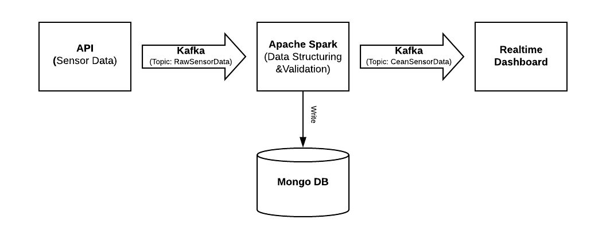
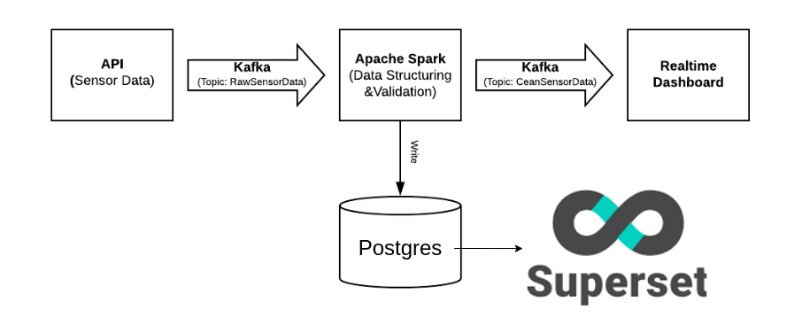
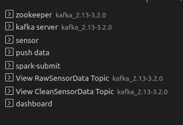

# Real-Time Data Pipeline Using Kafka and Spark

source: [here](https://github.com/Pahulpreet86/Real-Time-Data-Pipeline-Using-Kafka-and-Spark)
## Data Pipeline Architecture



In the future



-   ### API
   
	-  	 The API mimics the water quality sensor data similar to the one shared [here](https://data.world/cityofchicago/beach-water-quality-automated-sensors).
	    
	-   The implementation is done in flask web framework and the response is as follows:
	    

		‘2020-02-17T11:12:58.765969 26.04 540.1 13.12 Montrose_Beach 758028’

		

-   ### Kafka Producer (Topic: RawSensorData)
    
	
	-   The data from the API stream is pushed to Kafka Producer under topic: RawSensorData (In fact, using Random function to create data :D )
	    

  

		

-   ### Apache Spark and Kafka Consumer (Topic: CleanSensorData)
    

	-   The data under the topic RawSensorData is streamed through Kafka Consumer. The data is then structured and validated using Spark.
	    

	  

	-   The cleaned data is then pushed to MongoDB and Kafka Producer under topic: CleanSensorData
    

  

		

-   ### MongoDB
    
	(maybe use Postgres to replace it)

	-   The structured data is pushed to MongoDB collection with the following schema:
	    
		```markdown
		| Keys             | Data Type |
		|------------------|-----------|
		| _id              | Object Id |
		| Beach            | String    |
		| MeasurementID    | long      |
		| BatteryLife      | Double    |
		| RawData          | String    |
		| WaterTemperature | Double    |
		| Turbidity        | Double    |
		| TimeStamp        | timestamp |
		```  
  
  

-   ### Realtime Dashboard
    
(Can use Superset to replace it)

	-   The dashboard is implemented in the bokeh visualization library and data is streamed using Kafka Consumer under topic CleanSensorData.
	    

		

## Create environment

		python3 -m venv env
		source env/bin/activate


## How to run the code

  
Open 8 terminal tab for all process



-   #### Start the API (port: 3030)
    

  		 python sensor.py
	    

  

-   #### Start Zookeeper
    

		 bin/zookeeper-server-start.sh config/zookeeper.properties

    

  

-   #### Start Kafka
    

		bin/kafka-server-start.sh config/server.properties
    

  

-   #### Create RawSensorData Topic
    

		   bin/kafka-topics.sh --create --topic RawSensorData --bootstrap-server 127.0.0.1:9092 --replication-factor 1 --partitions 1
or 
		   bin/kafka-topics.sh --create --topic RawSensorData --bootstrap-server 127.0.0.1:9092 

    

  

-   #### Create CleanSensorData Topic
    		 
		 bin/kafka-topics.sh --create --topic CleanSensorData --bootstrap-server 127.0.0.1:9092
or
		 bin/kafka-topics.sh --create --topic CleanSensorData --bootstrap-server 127.0.0.1:9092 --replication-factor 1 --partitions 1

    
- ### check list of topics

		bin/kafka-topics.sh --bootstrap-server 127.0.0.1:9092 --list

-  #### Push Data From API Stream to Kafka Topic: RawSensorData
    

		python push_data_to_kafka.py
    

  

-   #### Structure and Validate Data, Push To MongoDB and Kafka Topic CleanSensorData
    

		  spark-submit --packages org.apache.spark:spark-streaming-kafka-0-10_2.13:3.2.1 structure_validate_store.py
or: 
		  spark-submit structure_validate_store.py
    

  

-  #### View RawSensorData Topic
    

		bin/kafka-console-consumer.sh --bootstrap-server localhost:9092 --topic RawSensorData --from-beginning
    

  

-   #### View CleanSensorData Topic
    

		bin/kafka-console-consumer.sh --bootstrap-server localhost:9092 --topic CleanSensorData --from-beginning
    

  

-   #### Real-Time DashBoard - Visualization
    

		bokeh serve --show dashboard.py


-  #### fix error 

Can't assign requested address: Service 'sparkDriver' failed after 16 retries" when running spark code [here](https://stackoverflow.com/questions/52133731/how-to-solve-cant-assign-requested-address-service-sparkdriver-failed-after): 

		export SPARK_LOCAL_IP="127.0.0.1"
