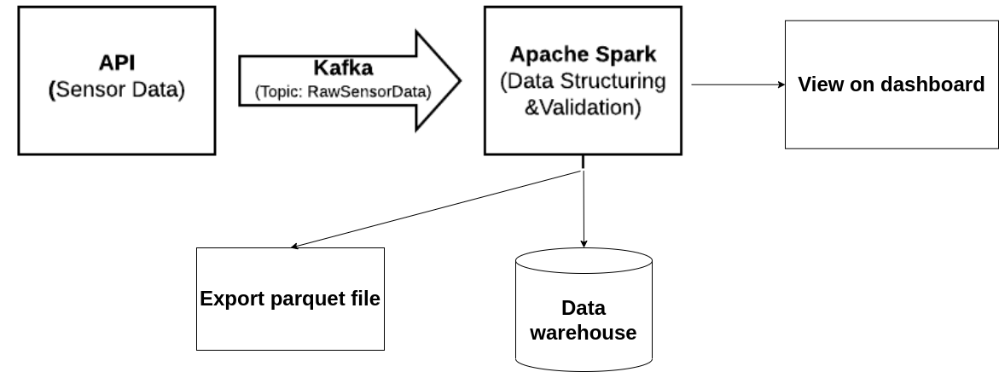

# Real-Time Data Pipeline Using Kafka and Spark

source: [here](https://github.com/Pahulpreet86/Real-Time-Data-Pipeline-Using-Kafka-and-Spark)
## Data Pipeline Architecture
In the future

-   ### API
   
	-  	 The API mimics the water quality sensor data similar to the one shared [here](https://data.world/cityofchicago/beach-water-quality-automated-sensors).
	    

-   ### Kafka Producer (Topic: RawSensorData)
    
	
	-   The data from the API stream is pushed to Kafka Producer under topic: RawSensorData (In fact, using Random function to create data :D )
	    

  

		

-   ### Apache Spark and Kafka Consumer (Topic: CleanSensorData)
    

	-   The data under the topic RawSensorData is streamed through Kafka Consumer. The data is then structured and validated using Spark.
	    

	  

	-   The cleaned data is then pushed to MongoDB and Kafka Producer under topic: CleanSensorData
    

  

		

  

-   ### Realtime Dashboard
    
(Can use Superset to replace it)

	-   The dashboard is implemented in the bokeh visualization library and data is streamed using Kafka Consumer under topic CleanSensorData.
	    

		

## Create environment

		python3 -m venv env
		source env/bin/activate

## How to run the code

  
Open 8 terminal tab for all process

-   #### Start the API (port: 3030)
    

  		 python sensor.py
	    

  

-   #### Start Zookeeper
    
	After install kafka, go to it's local

		 bin/zookeeper-server-start.sh config/zookeeper.properties

    

  

-   #### Start Kafka
    

		bin/kafka-server-start.sh config/server.properties
    

  

- ### check list of topics

		bin/kafka-topics.sh --bootstrap-server 127.0.0.1:9092 --list

-  #### Push Data From API Stream to Kafka Topic: RawSensorData
    

		python push_data_to_kafka.py
    

  

-   #### Structure and Validate Data
    

		python spark_submit.py
    

  

-  #### View RawSensorData Topic
    

		bin/kafka-console-consumer.sh --bootstrap-server localhost:9092 --topic RawSensorData --from-beginning
    

  

-   #### View CleanSensorData Topic
    

		bin/kafka-console-consumer.sh --bootstrap-server localhost:9092 --topic CleanSensorData --from-beginning
    

  

-   #### Real-Time DashBoard - Visualization
    

		bokeh serve --show dashboard.py

